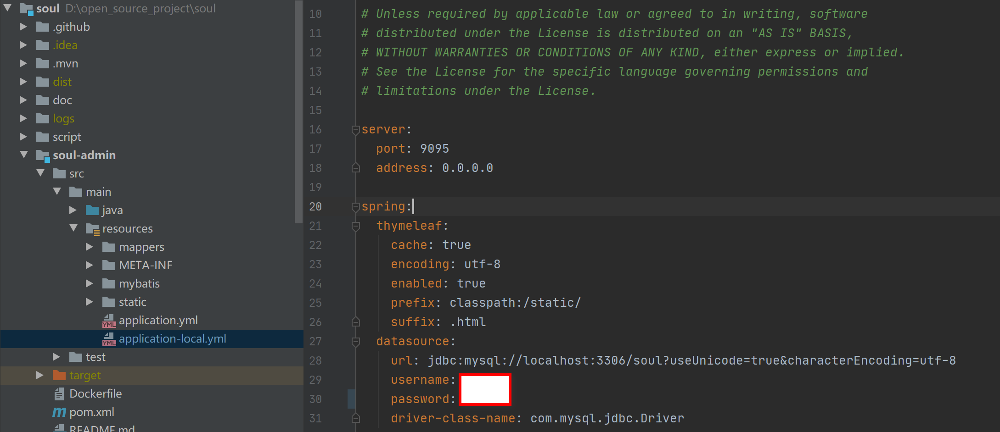
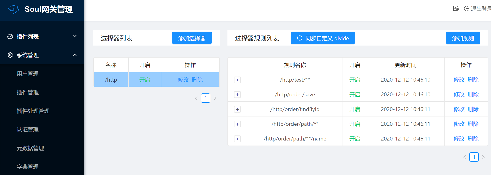
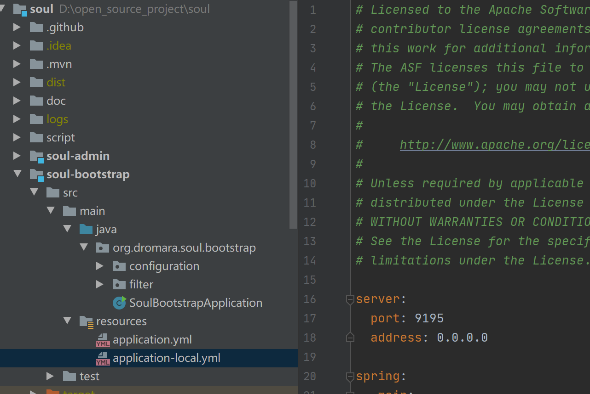

`Soul`是什么？引用`Soul`的官网：

> 这是一个异步的,高性能的,跨语言的,响应式的`API`网关。我希望能够有一样东西像灵魂一样，保护您的微服务。参考了`Kong`，`Spring-Cloud-Gateway`等优秀的网关后，站在巨人的肩膀上，`Soul`由此诞生！

好了，知道了`Soul`是一个网关，接下来就看看怎么使用它。 通过案例演示的方式比直接了解各个概念的方式更能激发兴趣。`play it!`

1. 从官网拉取项目源码 `git clone git@github.com:dromara/soul.git`。

2. 创建并切换分支`git checkout -b codeview`，在本地跑，直接用`master`分分支也行。

3. 使用`Idea`打开项目，然后本地编译一下，确保没有错。

   ```sh
   mvn clean install
   ```

   第一次编译会很慢，需要下载依赖。当然，也可以跳过测试和注释，会快一点。

   ```sh
   mvn clean install -Dmaven.test.skip=true -Dmaven.javadoc.skip=true
   ```

4. 启动`Soul`的后台管理地址，就是项目源码中的`soul-admin`模块，这是一个`SpringBoot`项目，只需要修改一下数据库的地址就可以运行了。项目会自动创建对应的库和表。

   

   项目启动后的登录地址是`http://localhost:9095/`，用户名是`admin`，密码是`123456`。后台界面如下：

   

   主要模块有插件列表和系统管理，在插件列表中可以对各个插件进行管理，每个插件都可以添加多个选择器，每个选择器都可以添加多条规则。实际这就是`Soul`拦截`URL`后的匹配规则：`插件->选择器->规则`，这个后面再细说。

5. 启动`Soul`的核心模块`soul-bootstrap`，这是网关的核心处理逻辑。不要怕他，这个模块本身不复杂，目录结构如下：

   

   

   启动成功后，就可以访问这个网关了`http://127.0.0.1:9195/`，返回信息如下：

   ```json
   {"code":-107,"message":"Can not find selector, please check your configuration!","data":null}
   ```

   

6. 通过上述步骤，就成功的搭建起`Soul`网关服务了，后面就是在自己的业务系统上使用网关。使用例子可以参考`soul-examples`模块。

7. 现在已经站在案例和源代码的层面了解了`Soul`网关，最后，看看`Soul`的特点和架构图吧。

   - 支持各种语言(`http`协议)，支持 `dubbo`，`spring cloud`协议。
   - 插件化设计思想，插件热插拔,易扩展。
   - 灵活的流量筛选，能满足各种流量控制。
   - 内置丰富的插件支持，鉴权，限流，熔断，防火墙等等。
   - 流量配置动态化，性能极高，网关消耗在` 1~2ms`。
   - 支持集群部署，支持 `A/B Test`，蓝绿发布。

   架构图

   

   

   接下来会运行`soul-examples`下面的 `http`服务，结合`divde`插件，发起`http`请求`soul`网关，体验`http`代理。

   

   参考文献：

   - [soul介绍](https://dromara.org/zh-cn/docs/soul/soul.html)

   

