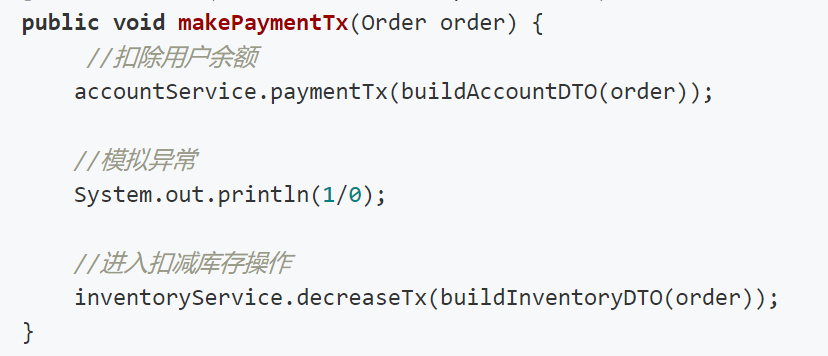
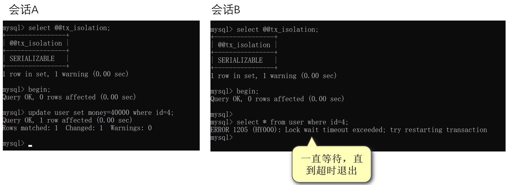

**事务**将多个读写操作捆绑在一起成为一个逻辑单元。这个逻辑单元中包括多条`SQL`语句，这些语句执行时要么一起成功，要么一起失败。

**事务案例：**

没有事务：在支付过程中，某一时间节点发生了异常，之前执行的“扣除用户余额”操作是不会回滚的，而“扣减库存”操作却没有执行。这会造成数据不一致的问题。（说明：这里的用户余额和库存在同一个数据库）

有事务：在支付过程中，某一时间节点发生了异常，之前执行的“扣除用户余额”操作会回滚，保持数据一致。（说明：这里的用户余额和库存在同一个数据库）

事务应该满足ACID四个特性。即：

**A：原子性**：数据库事务是不可分割的工作单位，只有所有操作都成功时，才算成功。任何一个SQL语句执行失败，已经执行成功的SQL语句也必须回退。在MySQL中原子性的实现可以通过redo log来保证。

**C：一致性**：数据库操作执行前后应该处于应用程序所期待的“预期状态”。应该满足数据库约束（比如外键约束，唯一性约束），业务要求（比如在转账前后，两个账户余额应该保持平衡）。在MySQL中一致性的实现可以通过undo log来保证。

**I：隔离性**：同时运行的事务不能相互干扰，该事务提交前对其他事务都不可见。这里需要区分的是在不同的隔离级别下，表现的结果是不一样的。在MySQL中隔离性可以通过锁来保证。

**D：持久性**：事务一旦提交，其结果就是永久性的，即使发生宕机，数据也能恢复。 在MySQL中持久性可以通过redo log来保证。

MySQL中的日志：

Undo log是逻辑日志，对每行记录不同版本。MVCC功能实现也基于此。Undo log是需要进行随机读写的。

Redo log是物理日志，记录物理页的修改。Redo log基本是顺序读写，是InnoDB引擎所特有的。

 

**事务隔离级别**

Read Uncommitted（读未提交）：一个事务的修改，对其他事务时可见的，即便还没有提交。

Read Committed（读已提交）：一个事务可以读取到其他事务提交的数据。

Repeatable Read（可重复读）：在同一个事务中多次读取同一个记录是一样的。

Serializable（可串行化）：所有事务都串行执行。

 

不同隔离级别造成的问题：

 

**隔离级别演示**

**读未提交**

操作时间节点：

| 时间 | 会话A                                                        | 会话B                                                        |
| ---- | ------------------------------------------------------------ | ------------------------------------------------------------ |
| 1    | set session transaction isolation level read  uncommitted;  select @@tx_isolation; | set session transaction isolation level read  uncommitted;  select @@tx_isolation; |
| 2    | begin;                                                       |                                                              |
| 3    | select * from user where id=1;                               |                                                              |
| 4    |                                                              | begin;                                                       |
| 5    |                                                              | update user set money=10 where id=1;                         |
| 6    | select * from user where id=1;                               |                                                              |
| 7    |                                                              | rollback;                                                    |

 

案例演示：

（MySQL版本是5.7）

在读未提交的隔离级别下会发生脏读，即一个事务会读取另一个事务为提交的数据。

 

**读已提交**

操作时间节点：

| 时间 | 会话A                                                        | 会话B                                                        |
| ---- | ------------------------------------------------------------ | ------------------------------------------------------------ |
| 1    | set session transaction isolation level read  committed;  select @@tx_isolation; | set session transaction isolation level read  committed;  select @@tx_isolation; |
| 2    | begin;                                                       |                                                              |
| 3    | select * from user where id=1;                               |                                                              |
| 4    |                                                              | begin;                                                       |
| 5    |                                                              | update user set money=10 where id=1;                         |
| 6    |                                                              | select * from user where id=1;                               |
| 7    | select * from user where id=1;                               |                                                              |
| 8    |                                                              | commit;                                                      |
| 9    | select * from user where id=1;                               |                                                              |

 

案例演示：

（MySQL版本是5.7）

在读已提交的隔离级别下，会发生不可重复读，即在同一个事务中，多次读取同一条记录的结果不一样。

 

**可重复读**

操作时间节点：

| 时间 | 会话A                                                        | 会话B                                                        |
| ---- | ------------------------------------------------------------ | ------------------------------------------------------------ |
| 1    | set session transaction isolation level repeatable read;  select @@tx_isolation; | set session transaction isolation level repeatable read;  select @@tx_isolation; |
| 2    | begin;                                                       |                                                              |
| 3    | select * from user where id=1;                               |                                                              |
| 4    |                                                              | begin;                                                       |
| 5    |                                                              | update user set money=10 where id=1;                         |
| 6    | select * from user where id=1;                               |                                                              |
| 7    |                                                              | commit;                                                      |
| 8    | select * from user where id=1;                               |                                                              |

 

案例演示：

（MySQL版本是5.7）

在可重复读的隔离级别下，多次读取同一条记录的结果是一样的，即可重复读。

 

幻读现象：在一个事务中，第一次查询某条记录，发现没有。但是，当试图更新这条不存在的记录时，竟然能成功，并且，再次读取同一条记录，它就神奇地出现了。

操作时间节点：

| 时间 | 会话A                                                        | 会话B                                                        |
| ---- | ------------------------------------------------------------ | ------------------------------------------------------------ |
| 1    | set session transaction isolation level repeatable read;  select @@tx_isolation; | set session transaction isolation level repeatable read;  select @@tx_isolation; |
| 2    | begin;                                                       |                                                              |
| 3    |                                                              | begin;                                                       |
| 4    | select * from user where id=99;                              |                                                              |
| 5    |                                                              | insert into user(id,money)  value(99,1000);                  |
| 6    |                                                              | commit;                                                      |
| 7    | select * from user where id=99;                              |                                                              |
| 8    | update user set money=2000 where id=99;                      |                                                              |
| 9    | update user set money=2000 where id=99;                      |                                                              |

 

案例演示：

（MySQL版本是5.7）

 

在可重复读的隔离级别下并没有彻底的解决幻读问题，如果需要解决幻读，有两个办法：

-  使用串行化读的隔离级别。

-  MVCC+next-key locks：next-key locks由record locks(索引加锁) 和 gap locks(间隙锁)。
   

参考文献：

https://www.liaoxuefeng.com/wiki/1177760294764384/1245268672511968

 

**可串行化**

操作时间节点：

| 时间 | 会话A                                                        | 会话B                                                        |
| ---- | ------------------------------------------------------------ | ------------------------------------------------------------ |
| 1    | set session transaction isolation level serializable;  select @@tx_isolation; | set session transaction isolation level serializable;  select @@tx_isolation; |
| 2    | begin;                                                       |                                                              |
| 3    | update user set money=40000 where id=4;                      |                                                              |
| 4    |                                                              | begin;                                                       |
| 5    |                                                              | select * from user where id=4;                               |

 

案例演示：

（MySQL版本是5.7）

在可串行化的隔离级别下，一个事务会等待另一个事务操作完成后，才能执行。否则，会一直等待，直到超时退出。

 

**分布式事务**

前面介绍的都是单体事务，针对一个数据库进行操作。但是当业务越来越复杂，数据量越来越大的时候，将会进行分库分表。特别是在微服务的场景下，每个服务都有自己的数据库。之前的单体事务无法处理跨库事务，这需要分布式事务来处理。

**跨库事务案例演示**：

背景：用户下单一般有三个操作：1.保存订单；2.扣减用户余额；3.扣减物品库存。这三个操作要么一起完成，要么一起失败，组成一个事务。另外用户下单功能是基于微服务搭建的系统，涉及3个微服务（订单服务/账户服务/库存服务），3个库（订单库/账户库/库存库）。微服务之间使用RPC完成方法的调用（这里用的是Dubbo）。

现在三个库的基本信息如下：

1. 订单库暂时没有数据

2. 账户库：当前用户的账户余额有100元。

3. 库存库：当前物品剩余数量是1000。

​    现在模拟一个用户下单操作：

​    发起一个订单请求：需要扣减1个库存，扣除1元钱。

​    在业务处理的时候，发生了一个异常，导致下单操作不成功。造成的结果是：订单保存成功了，用户余额也被扣减了，但是库存并没有减少。（下面截图省略了controller层，只是展示了service层）。

​    执行上述方法之后，三个库的状态如下：

1. 订单库生成了一个订单。

2. 账户库的余额被扣减了1元。

3. 库存库没有发生改变

​    通过上述案例的演示，可以发现管理单体事务的**@Transactional**在当前分布式事务中场景下并没有生效。没有让各个操作一起完成或一起失败。

  **@Transactional**(rollbackFor = Exception.class)

​    那么上述问题应该如何解决？这就需要分布式事务。

**分布式事务**：在分布式系统中，多个节点操作的整体事务应该保持一致。在实际场景中，一个业务操作需要事务A和事务B共同完成，如果事务A成功，事务B失败，那么整体数据是不一致的。

实现思路：

1. 多个数据库之间通过某种机制协调，保证跨库节点的一致性。

2. 可以容忍一段时间内数据不一致，后续通过调度补偿，实现数据的最终一致性。

 

解决方案：

1. 强一致性：XA

2. 弱一致性：

   a)    不用事务，业务补偿冲正。

   b)    使用柔性事务，通过一套框架来实现最终的一致性。

**XA分布式事务协议**

XA是由X/Open组织提出的分布式事务规范。 XA规范主要定义了(全局)事务管理器(TM)和(局部)资源管理器(RM)之间的接口。主流的关系型数据库产品都是实现了XA接口。MySQL5.0开始支持InnoDB存储引擎的XA事务。

 

**XA规范**

**XA 接口**

xa_star ：负责开启或者恢复一个事务分支

xa_end： 负责取消当前线程与事务分支的关联

xa_prepare：询问 RM 是否准备好提交事务分支

xa_comit：通知 RM 提交事务分支

xa_rolback： 通知 RM 回滚事务分支

xa_recover : 需要恢复的 XA 事务

 

**完整的XA事务处理过程**

上述演示的是3个事务操作，每个事务完成后会进入prepare状态，事务管理器TM收集到所有的prepare状态后，根据实际执行结果，再通知各个事务执行提交或回滚操作。

XA的实现需要数据库隔离级别为Serializable，所以效率很低。

 

**BASE****柔性事务**

如果将实现了ACID的事务要素的事务称为刚性事务的话，那么基于BASE事务要素的事务则称为柔性事务。BASE是基本可用、柔性状态和最终一致性这三个要素的缩写。

- 基本可用（Basically Available）保证分布式事务参与方不一定同时在线。

- 柔性状态（Soft state）则允许系统状态更新有一定的延时，这个延时对客户来说不一定能够察觉。

- 最终一致性（Eventually consistent）通常是通过消息可达的方式保证系统的最终一致性。

柔性事务的理念则是通过业务逻辑将互斥锁操作从资源层面上移至业务层面。通过放宽对强一致性要求，来换取系统吞吐量的提升。基于ACID的强一致性事务和基于BASE的最终一致性事务都不是银弹，只有在最适合的场景中才能发挥它们的最大长处。

 

BASE柔性事务实现模式

1. TCC：通过手工补偿处理

2. AT：通过自动补偿处理。

 

**TCC**的全称是（Try-Confirm-Cancel）

TCC又可以被称为两阶段补偿事务，第一阶段try只是预留资源，第二阶段要明确的告诉服务提供者，这个资源你到底要不要，对应第二阶段的confirm/cancel，用来清除第一阶段的影响，所以叫补偿型事务。

 

 

TCC的缺点，对代码入侵性大！每套业务逻辑、都要按try(请求资源)、confirm(操作资源)、cancel(取消资源)，拆分为三个接口！

 参考资料：

https://www.cnblogs.com/rjzheng/p/10164667.html

 **AT两阶段提交，自动反向生成SQL**

 

AT包括两阶段：

1. 所有参与事务的分支，本地事务commit业务数据和回滚日志。

2. 事务协调者根据分支情况，决定本次全局事务是commit还是rollback。

 

**Saga** **是一种补偿协议，长事务解决方案。**

在 Saga 模式下，分布式事务内有多个参与者，每一个参与者都是一个冲正补偿服务，需要用户根据业务场景实现其正向操作和逆向回滚操作。Saga 正向服务与补偿服务也需要业务开发者实现。

分布式事务执行过程中，依次执行各参与者的正向操作，如果所有正向操作均执行成功，那么分布式事务提交。如果任何一个正向操作执行失败，那么分布式事务会退回去执行前面各参与者的逆向回滚操作，回滚已提交的参与者，使分布式事务回到初始状态。
 

参考文献：

http://seata.io/zh-cn/blog/seata-at-tcc-saga.html

**四种模式的特点：**

- XA模式对数据一致性要求很高，但是执行效率低。

- AT模式是无侵入的分布式事务解决方案，适用于不希望对业务进行改造的场景，几乎0学习成本。

- TCC模式是高性能分布式事务解决方案，它不需要全局锁，适用于核心系统等对性能有很高要求的场景。

- Saga模式是长事务解决方案，适用于业务流程长且需要保证事务最终一致性的业务系统，Saga 模式一阶段就会提交本地事务，无锁，长流程情况下可以保证性能，多用于渠道层、集成层业务系统。事务参与者可能是其它公司的服务或者是遗留系统的服务，无法进行改造和提供 TCC 要求的接口，也可以使用 Saga 模式。

**分布式事务框架**

**Seata**

Seata是 2019 年 1 月份蚂蚁金服和阿里巴巴共同开源的分布式事务解决方案。Seata有4种分布式事务解决方案，分别是 AT 模式、TCC 模式、Saga 模式和 XA 模式。

**Hmily**

Hmily是柔性分布式事务解决方案，提供了TCC 与 TAC 模式。它以零侵入以及快速集成方式能够方便的被业务进行整合。在性能上，日志存储异步（可选）以及使用异步执行的方式，不损耗业务方法方法。之前是由作者个人开发，目前由作者在京东数科已经重新启动，未来将会是金融场景的分布式事务解决方案。

**ShardingSphere**

Apache ShardingSphere 是一套开源的分布式数据库中间件，它们均提供标准化的数据分片、读写分离、分布式事务和数据库治理功能。ShardingSphere 已于2020年4月16日成为 Apache 软件基金会的顶级项目。在分布式事务模块支持XA事务和Seata的柔性事务。

**RocketMQ****分布式事务**

事务消息不仅适用于上游事务对下游事务无依赖的场景，还可以与一些传统分布式事务架构相结合，而 MQ 的服务端作为天生的具有高可用能力的协调者，使得我们未来可以基于 RocketMQ 提供一站式轻量级分布式事务解决方案，用以满足各种场景下的分布式事务需求。

 

**基于Hmily的TCC事务演示：**

在介绍分布式事务之前，通过一个小案例说明了单体事务在分布式场景中存在的问题。现在通过Hmily框架演示TCC是如何完成分布式事务的。

1.订单服务的try-confirm-cancel

Try：设置订单状态为支付中。预留资源，用于确认或回退。

 Confirm：修改订单状态为成功。执行真正的业务逻辑，确认资源。

 Cancel：修改订单状态为失败，取消资源。

2.账户服务的try-confirm-cancel

Try：扣减账户的余额，冻结扣减的金额作为预留资源，用于确认或回退。

在账户表中，新增了一个字段freeze_amount，表示冻结的金额，即在实际业务中需要扣减的金额。

 Confirm：确认资源，更新冻结的余额。

Cancel：释放资源，恢复账户余额，更新冻结的余额。

3.库存服务的try-confirm-cancel

Try：扣减库存个数，冻结扣减的库存作为预留资源，用于确认或回退。

在库存表中，新增了一个字段lock_inventory，表示冻结的库存，即在实际业务中需要扣减的库存。

 Confirm：确认资源，更新冻结的库存。

Cancel：释放资源，恢复库存总数，更新冻结的库存。

  

通过TCC可以满足分布式场景中对事务的要求。

更多的例子可以参考Hmil官方Demo：

https://github.com/dromara/hmily/tree/master/hmily-demo

 

 